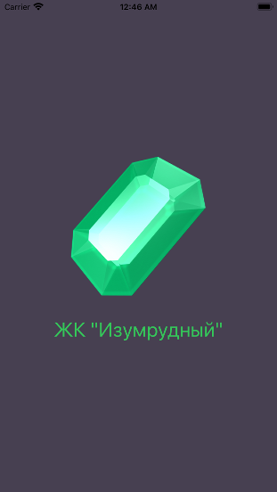
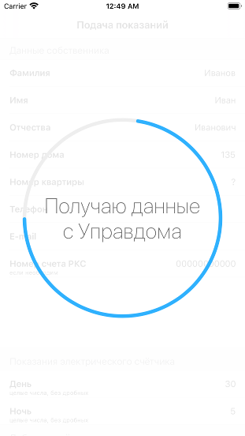
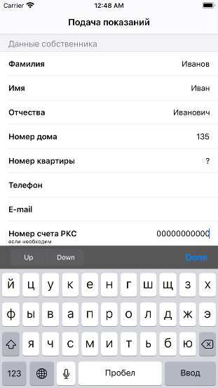

# ЖК "Изумрудный"

Приложение для жильцов комплекса "Изумрудный" в Самаре, для удобной отправки показаний.
Распространяется свободно с исходным текстом программы в [AppStore для операционной системы iOS](https://apps.apple.com/ru/app/%D0%B6%D0%BA-%D0%B8%D0%B7%D1%83%D0%BC%D1%80%D1%83%D0%B4%D0%BD%D1%8B%D0%B9/id1529496229) согласно лицензии [GNU GPL 3.0](https://www.gnu.org/licenses/quick-guide-gplv3.ru.html)

# Скриншоты

  

# Лицензия

[GNU GPL 3.0](https://www.gnu.org/licenses/quick-guide-gplv3.ru.html)
